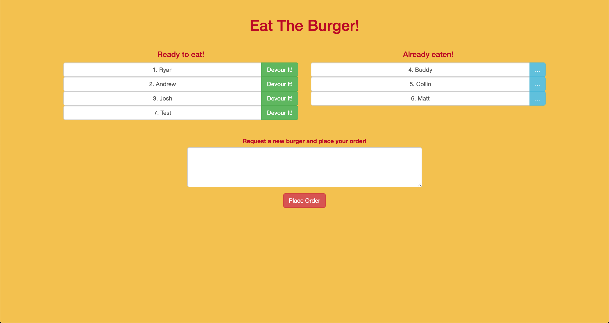

# Eat The Burger
A full stack, MVC (Model-View-Controller) application that allows you to create burgers (POST), view a list of burgers available to eat (GET), devour burgers (PUT), and throw them away after devoured (DELETE).
## Explanation
---
The user may enter any burger name to add it to the menu. This also adds the new burger entry into the MySQL database. The initial burger entry is added as available on the menu and placed on the left side of the screen. The user may then eat any burger by clicking on it, which moves it into the adjacent column and updates its status accordingly in the database.
---
## Technologies Used:
---
#### Backend technologies
- Node.js (https://nodejs.org/en/)
- MySQL (https://www.mysql.com/)
- Express (http://expressjs.com/)
- ORM - Object Relational Mapping (https://en.wikipedia.org/wiki/Object-relational_mapping)
#### Frontend technologies
- HTML
- CSS
- Bootstrap (http://getbootstrap.com/)
- Javascript
- jQuery (https://jquery.com/)
- Handlebars (http://handlebarsjs.com/)

## Screenshots:
---
